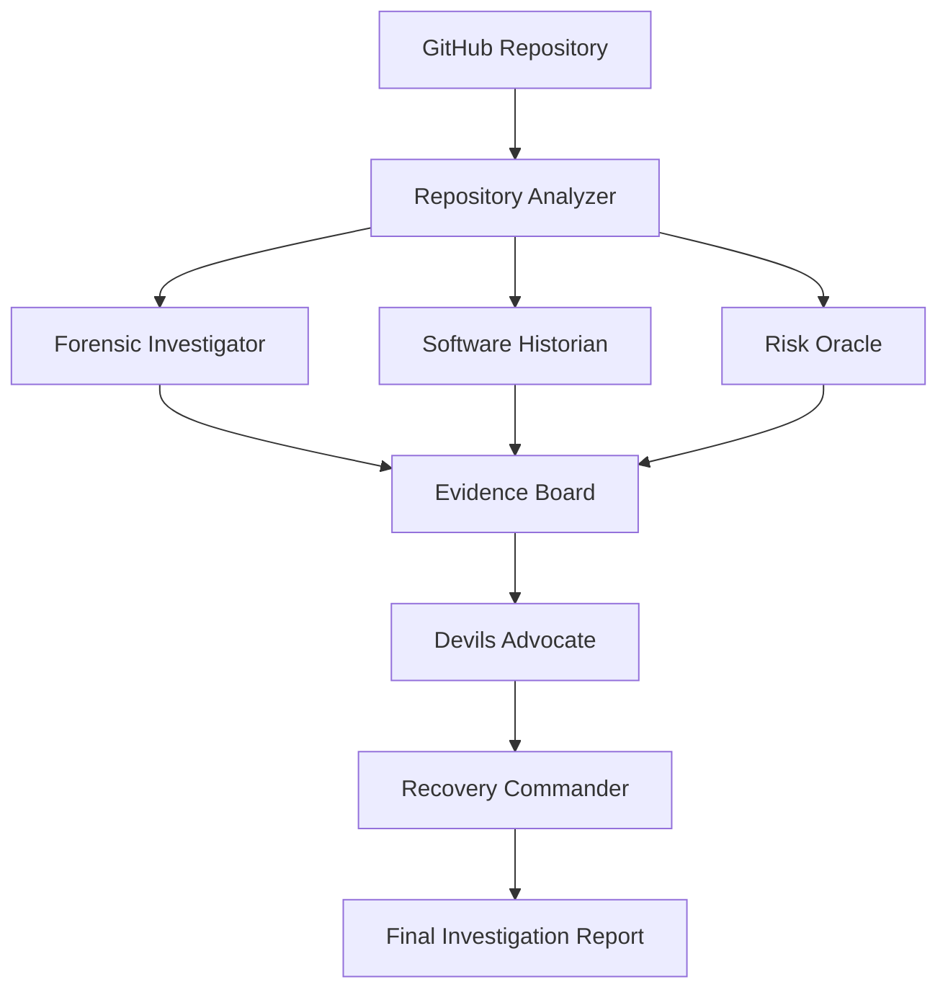
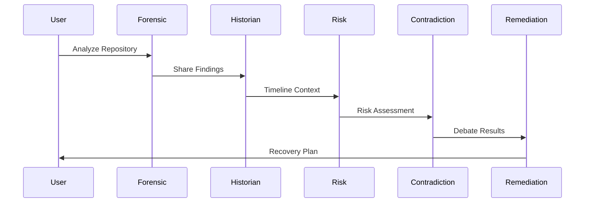
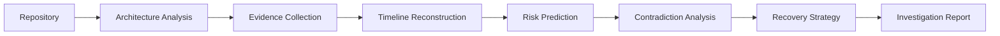

# 👻 GhostTrace

> **AI-Powered Software Investigation Room**

GhostTrace is an AI-powered software investigation platform that helps developers understand **why a codebase became difficult to maintain**, not just what is wrong with it.

Unlike traditional static analyzers that generate warnings and metrics, GhostTrace reconstructs the story of a software system by analyzing its architecture, dependencies, code structure, and engineering patterns through a team of specialized AI investigators.

The result is a forensic-style investigation report that identifies architectural decay, technical debt, risky engineering decisions, future failure points, and actionable recovery strategies.

---

# 🚨 Problem

Modern software systems slowly become harder to maintain because of:

- Technical debt accumulation
- Architectural drift
- Dependency sprawl
- Inconsistent engineering decisions
- Lack of historical context

Existing tools answer:

> What is wrong?

GhostTrace answers:

> How did we get here, and what happens next?

---

# ✨ Core Idea

Think of GhostTrace as a software crime investigation room.

Instead of generating another lint report, GhostTrace:

1. Collects evidence
2. Reconstructs history
3. Predicts future risks
4. Challenges assumptions
5. Generates recovery plans

---

# 🕵️ AI Investigation Team

## 🔬 Forensic Investigator

Examines:

- Code quality
- Technical debt
- Architectural violations
- Dependency complexity
- Suspicious engineering patterns

Produces:

- Evidence report
- Architecture findings
- Debt indicators

---

## 📜 Software Historian

Reconstructs:

- Repository evolution
- Architectural drift
- Dependency growth
- System degradation timeline

Produces:

- Timeline of events
- Escalation points
- Degradation narrative

---

## ⚠️ Risk Oracle

Predicts:

- Future failures
- High-risk modules
- Dependency collapse risks
- Stability concerns

Produces:

- Risk forecasts
- Risk scores
- Failure predictions

---

# 🏗 System Architecture



---

# 🔄 Agent Workflow



---

# 🧠 Investigation Pipeline



---

# 🎯 Features

## Repository Intelligence

- Architecture analysis
- Dependency mapping
- Technical debt detection
- Complexity assessment

## Historical Intelligence

- Timeline reconstruction
- Architectural drift detection
- Evolution tracking

## Predictive Intelligence

- Risk forecasting
- Failure prediction
- Stability analysis

## Recovery Intelligence

- Refactoring recommendations
- Prioritized fixes
- Recovery roadmap

---

# 💡 Why GhostTrace Is Different

| Traditional Tools | GhostTrace |
|------------------|------------|
| Detect issues | Investigates causes |
| Static reports | Narrative investigation |
| Present-state analysis | Historical reconstruction |
| Lists warnings | Explains engineering decisions |
| Finds problems | Predicts future failures |

---

# 🔥 Example Questions GhostTrace Answers

- Why did this architecture become unstable?
- Which decisions caused technical debt?
- What subsystem is most likely to fail next?
- Which dependencies are creating risk?
- What should be fixed first?
- How serious is the long-term maintenance risk?

---

# 🏗 Technical Stack

### Frontend

- Next.js
- React
- TypeScript
- TailwindCSS
- Framer Motion

### AI Layer

- Multi-Agent Architecture
- LLM Reasoning
- Repository Intelligence Engine

### Analysis Layer

- Architecture Analysis
- Risk Analysis
- Timeline Reconstruction
- Contradiction Framework

---

# 📂 Project Structure

```text
ghosttrace/

├── app/
│   ├── api/
│   └── page.tsx
│
├── agents/
│   ├── forensic.ts
│   ├── historian.ts
│   ├── risk.ts
│   ├── contradiction.ts
│   ├── remediation.ts
│   └── orchestrator.ts
│
├── components/
│   ├── WarRoom.tsx
│   ├── Timeline.tsx
│   ├── RiskPanel.tsx
│   ├── AgentCard.tsx
│   └── EvidenceBoard.tsx
│
├── lib/
├── hooks/
├── types/
└── public/
```

---

# 🚀 Getting Started

## Clone Repository

```bash
git clone https://github.com/VishakhaVB/ghosttrace-agents.git
```

## Install Dependencies

```bash
npm install
```

## Run Development Server

```bash
npm run dev
```

## Open

```text
http://localhost:3000
```

---

# 🔮 Future Roadmap

- GitHub Commit Intelligence
- Pull Request Investigation
- Team Ownership Analysis
- Architectural Drift Visualization
- CI/CD Integration
- Multi-Repository Comparison
- Enterprise Engineering Health Dashboard

---

teams understand why a codebase became difficult to maintain and what should be done next.
